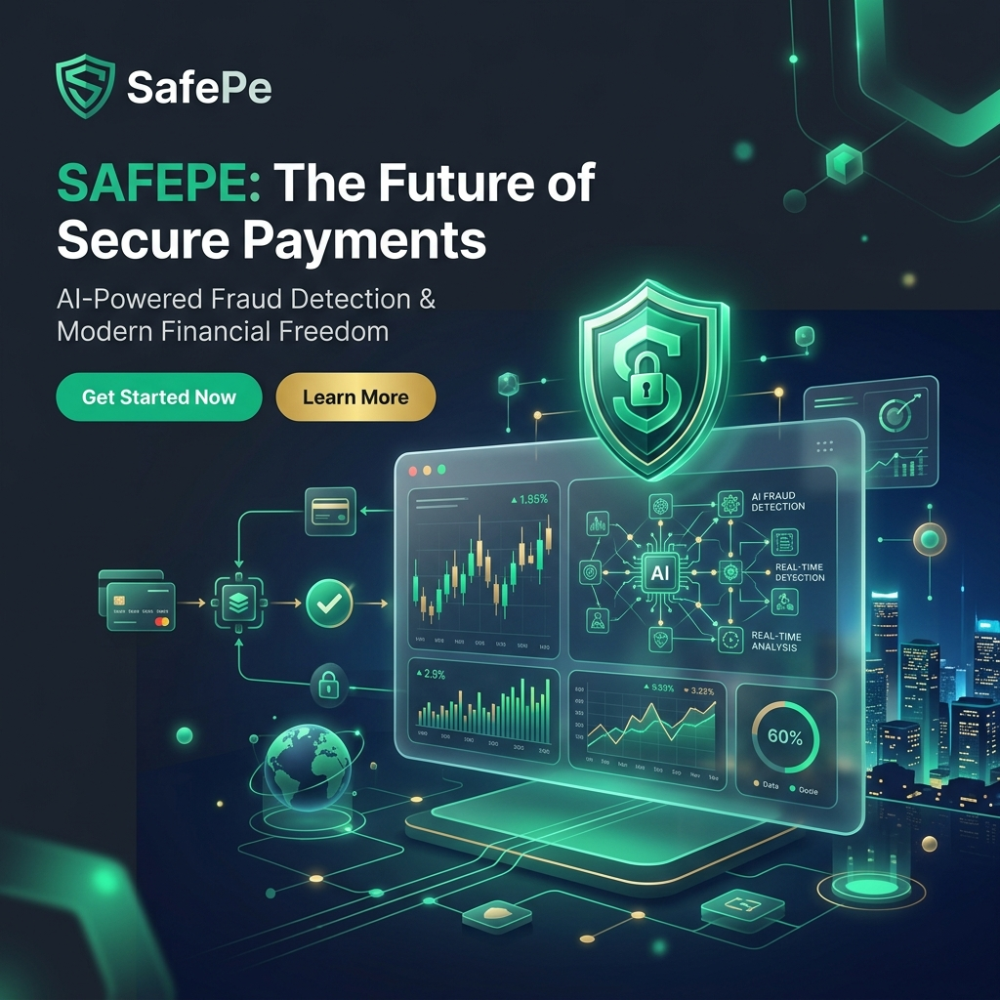
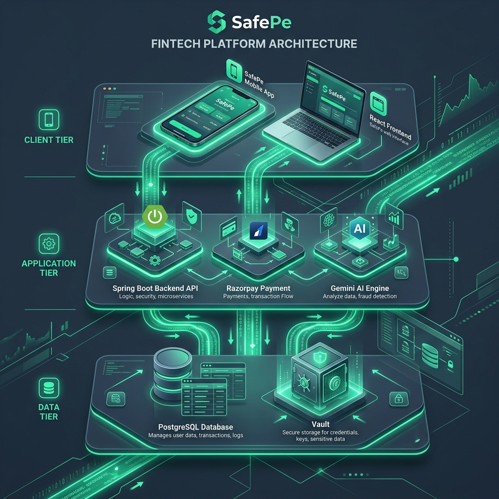

<div align="center">
  

  <h1>🛡️ SafePe</h1>
  <p><strong>Next-Generation Secure Financial Platform Powered by AI</strong></p>

  [](http://13.60.235.28:3000)
  [](https://reactjs.org/)
  [](https://spring.io/)
  [](https://postgresql.org/)
  [](https://razorpay.com/)
  [](https://deepmind.google/technologies/gemini/)

  <p align="center">
    <a href="#features">Features</a> •
    <a href="#architecture">Architecture</a> •
    <a href="#getting-started">Getting Started</a>
  </p>
</div>

---

## 🚀 Welcome to SafePe

SafePe is a premium fintech web application designed with an ultra-secure, 3-tier architecture. It provides users with seamless digital payments, AI-driven financial advice (Fixed Deposit Rates), and real-time fraud detection. 

### 🌟 Key Features
- **Secure UPI & Bank Payments:** Seamless integration with the Razorpay Payment Gateway.
- **AI Fraud Detection:** Real-time AI scanning of transactions and merchant trust scores.
- **Live FD Rates:** Real-time fixed deposit rate scraping and analysis powered by Google Gemini AI.
- **PCI-DSS Compliant Backend:** Bank-grade encryption and tokenization for all sensitive data.
- **Glassmorphism UI:** A stunning, modern, and responsive interface built with React.

---

## 🏗️ 3-Tier Security Architecture

SafePe is engineered with a strict 3-tier separation of concerns, ensuring that public-facing systems never directly touch sensitive financial data.

<div align="center">
  
</div>

### 🌐 Layer 1: Presentation (React Frontend)
The outer layer responsible for the user interface. It acts as a dumb terminal, securely communicating with Layer 2 via authenticated REST APIs (Clerk JWTs). It contains **zero** business logic or secrets.

### ⚙️ Layer 2: Business Logic (Spring Boot API)
The core engine of SafePe. This layer orchestrates payment flows, handles business rules, and communicates with external services like **Razorpay** and **Google Gemini AI**. It never stores raw sensitive data.

### 🗄️ Layer 3: Data & Storage (PostgreSQL)
The deepest, most protected layer. Accessible *only* by Layer 2. All sensitive merchant data, transaction history, and user profiles are stored here with military-grade encryption.

---

## 🔗 Live Website Demo

👉 **[Launch SafePe Live Platform](http://13.60.235.28:3000)**

*(Note: The platform is currently running on a secure AWS EC2 instance. Ensure you use test UPI IDs when simulating payments!)*

---

## 🛠️ Getting Started (Local Development)

If you want to run SafePe locally on your own machine, follow these steps:

### Prerequisites
- Docker & Docker Compose installed
- API Keys for Clerk (Auth), Razorpay, and Google Gemini

### Run with Docker Compose
```bash
# 1. Clone the repository
git clone https://github.com/pavansaiambala7/safepe.git
cd safepe

# 2. Add your API keys to the frontend and backend .env files
# Check .env.example for required variables

# 3. Spin up the entire 3-tier stack (Postgres, Spring Boot, React)
docker compose up -d --build
```
The application will be available at `http://localhost:3000`.

---
<div align="center">
  <i>Built with ❤️ for secure and beautiful digital finance.</i>
</div>
