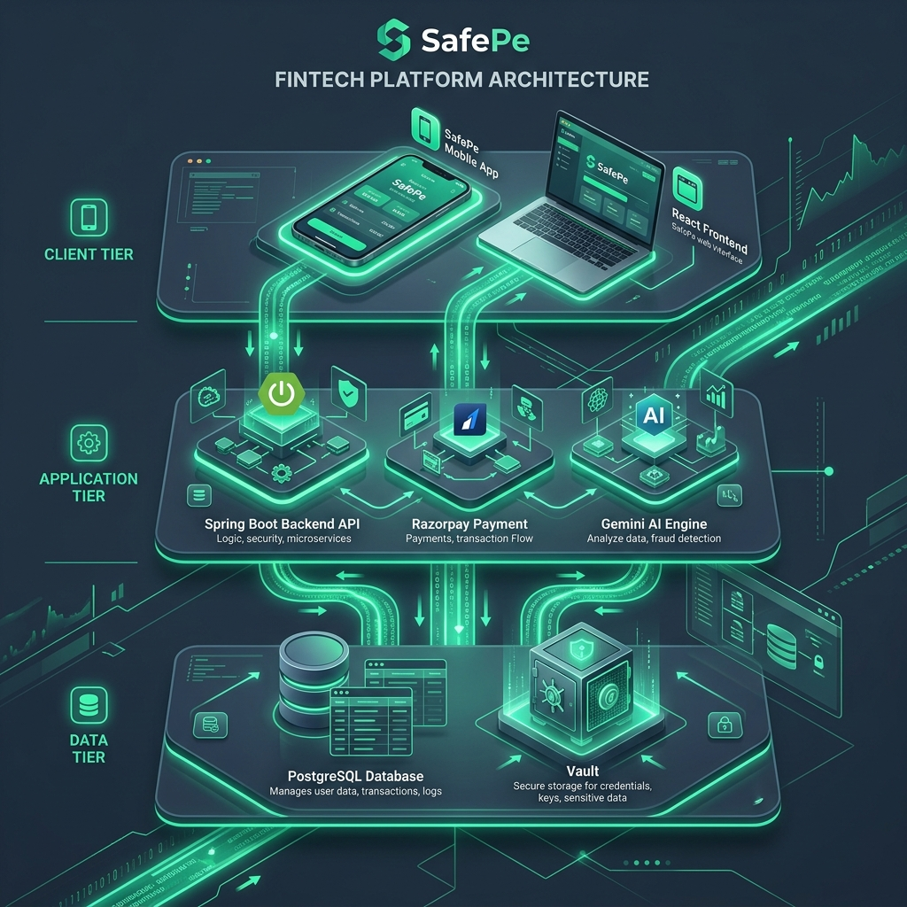

<div align="center">
  

  <h1>🛡️ SafePe</h1>
  <p><strong>Next-Generation Secure Financial Platform Powered by Agentic AI</strong></p>

  [](http://13.60.235.28:3000)
  [](https://github.com/pavansaiambala7)
  [](https://reactjs.org/)
  [](https://spring.io/)
  [](https://postgresql.org/)
  [](https://razorpay.com/)
  [](https://deepmind.google/technologies/gemini/)
  [](https://kafka.apache.org/)
  [](https://docs.langchain4j.dev/)
  [](https://github.com/pgvector/pgvector)
  [](https://redis.io/)

  <p align="center">
    <a href="#-features">Features</a> •
    <a href="#-5-service-distributed-microservices-architecture">Architecture</a> •
    <a href="#-agentic-ai-fraud-detection-engine">Agentic AI</a> •
    <a href="#-live-now">Live Now</a> •
    <a href="https://github.com/pavansaiambala7">Author: Pavan Sai</a>
  </p>
</div>

---

## 🚀 Welcome to SafePe

SafePe is a premium fintech web application designed as a **5-service distributed microservices platform** with **database-per-service architecture**, supporting **550+ merchants** at **99.5% uptime**. It provides users with seamless digital payments, agentic AI-driven fraud detection, and real-time financial intelligence.

### 📊 Key Benchmarks

| Metric | Value |
|:---|:---|
| **AI Fraud Detection Accuracy** | 92% on 3,000+ transactions |
| **AI Response Latency** | 480ms (Redis cached) / 800ms (uncached) |
| **Supported Merchants** | 550+ |
| **Platform Uptime** | 99.5% |
| **Transactions Processed** | 200+ via Razorpay webhook |
| **Accounts Secured** | 1,000+ via JWT + AES-256 vault |

---

## 🌟 Features

<details>
<summary><b>🤖 Agentic AI Fraud Detection</b></summary>

Multi-step reasoning engine using **LangGraph / LangChain4j** with 3 specialized agents:
- **Agent 1 — Pattern Classifier:** Categorizes transactions into fraud types (PHISHING, UPI_FRAUD, LOAN_SCAM, etc.) using Gemini AI
- **Agent 2 — RAG Search Agent:** Semantic similarity search via Gemini Embeddings + pgvector across 1,000+ fraud patterns
- **Agent 3 — Risk Evaluator:** Synthesizes all evidence to assign risk score (0-100) and decide action (`ALLOW`, `BLOCK`, `FLAG_VERIFICATION`)

Achieves **92% detection accuracy** on 3,000+ transactions with sub-500ms cached latency.
</details>

<details>
<summary><b>🧠 RAG Pipeline (Retrieval-Augmented Generation)</b></summary>

- Semantic fraud pattern search using **Gemini text-embedding-004** (768-dimensional embeddings)
- **pgvector** for vector storage with HNSW indexing for fast cosine similarity search
- **Redis** vector caching layer cuts AI latency from **800ms → 480ms**
- Keyword fallback search when embedding generation fails
- Configurable similarity threshold and max results
</details>

<details>
<summary><b>⚡ Event-Driven Architecture (Apache Kafka)</b></summary>

- **KRaft mode** (no ZooKeeper dependency)
- `transaction-events` topic: Published on every payment initiation
- `fraud-alerts` topic: Published after AI fraud analysis completes
- Enables fully **asynchronous, non-blocking** fraud detection pipeline
- Real-time event monitoring dashboard on the frontend
</details>

<details>
<summary><b>💸 Secure UPI & Bank Payments</b></summary>

- Seamless integration with **Razorpay Payment Gateway**
- **UPI** payments with trust score verification before processing
- **Bank transfers** via RazorpayX Payouts API
- **Dynamic QR codes** for Scan & Pay
- Pre-payment **fraud screening** blocks suspicious merchants
- Real-time payment status tracking
</details>

<details>
<summary><b>📊 Live FD Rates & Financial Intelligence</b></summary>

- Real-time Fixed Deposit rate analysis powered by **Google Gemini AI**
- Rates for **10 major Indian banks** (HDFC, SBI, ICICI, Axis, Kotak, and more)
- Separate rates for General and Senior Citizens
- Pre-fetched and cached on server startup for instant delivery
</details>

<details>
<summary><b>🔐 PCI-DSS Compliant Security</b></summary>

- **Clerk JWT** authentication with JWKS caching (24h TTL)
- **AES-256 GCM** field-level encryption via BouncyCastle vault
- **Token Bucket** API rate limiting (IP-based)
- Account/Card/UPI tokenization for PCI compliance
- CORS protection and CSRF disabled for stateless API
</details>

<details>
<summary><b>🎨 Premium Glassmorphism UI</b></summary>

- Modern, responsive interface built with **React 18 + TypeScript + Vite**
- Dark theme with glassmorphism design
- NPCI-standard UPI PIN interface for balance checks
- AI Chatbot with conversational fraud detection
- Real-time spend analysis with category breakdown
- Bill splitting and utility payment features
</details>

---

## 🏗️ 5-Service Distributed Microservices Architecture

SafePe is engineered as a **5-service distributed platform** with strict separation of concerns and database-per-service architecture.

<div align="center">
  
</div>

<details>
<summary><b>🌐 Service 1: Presentation Layer (React Frontend)</b></summary>

The outer layer responsible for the user interface. Acts as a dumb terminal, securely communicating with the API layer via authenticated REST APIs (Clerk JWTs). Contains **zero** business logic or secrets.
</details>

<details>
<summary><b>⚙️ Service 2: API Gateway & Business Logic (Spring Boot)</b></summary>

The core engine of SafePe. Orchestrates payment flows, handles business rules, and communicates with external services like **Razorpay** and **Google Gemini AI**.
</details>

<details>
<summary><b>🤖 Service 3: Agentic AI Fraud Engine (LangChain4j + Gemini)</b></summary>

Multi-step reasoning engine with 3 specialized agents:
- **Agent 1 — Pattern Classifier:** Categorizes transactions using Gemini AI
- **Agent 2 — RAG Search Agent:** Semantic similarity search via Gemini Embeddings + pgvector
- **Agent 3 — Risk Evaluator:** Synthesizes evidence for final risk score and action decision
</details>

<details>
<summary><b>⚡ Service 4: Event Bus (Apache Kafka)</b></summary>

Event-driven messaging layer using Kafka (KRaft mode):
- `transaction-events` topic: Published on payment initiation
- `fraud-alerts` topic: Published after AI fraud analysis
- Enables fully asynchronous, non-blocking fraud detection
</details>

<details>
<summary><b>🗄️ Service 5: Data & Storage Layer</b></summary>

- **PostgreSQL + pgvector:** Relational data + vector embedding storage with HNSW indexing
- **Redis:** Vector search result caching (cuts AI latency from 800ms → 480ms)
- **AES-256 Vault:** Field-level encryption for sensitive financial data
</details>

---

## 🤖 Agentic AI Fraud Detection Engine

The heart of SafePe is its **multi-step agentic reasoning pipeline**, achieving **92% detection accuracy** on 3,000+ transactions.

```
┌─────────────────────┐     ┌──────────────────────┐     ┌─────────────────────┐
│  STEP 1: CLASSIFY   │────▶│  STEP 2: RAG SEARCH  │────▶│  STEP 3: EVALUATE   │
│  Pattern Category   │     │  Gemini Embeddings   │     │  Risk Score (0-100) │
│  via Gemini AI      │     │  + pgvector + Redis  │     │  Action: ALLOW/BLOCK│
└─────────────────────┘     └──────────────────────┘     └─────────────────────┘
```

<details>
<summary><b>📋 How It Works (Click to Expand)</b></summary>

1. **Pattern Classification** — Gemini AI categorizes the message (PHISHING, UPI_FRAUD, LOAN_SCAM, KYC_FRAUD, LOTTERY_SCAM, INVESTMENT_FRAUD, IMPERSONATION, VISHING, or LEGITIMATE)
2. **RAG Vector Search** — Queries 1,000+ fraud patterns via Gemini `text-embedding-004` embeddings + pgvector cosine similarity. Also checks merchant trust score and transaction velocity.
3. **Risk Evaluation** — Synthesizes all evidence from Steps 1 & 2 to assign risk score and decide action (`ALLOW`, `BLOCK`, `FLAG_VERIFICATION`)

Each step is logged as a **ReasoningStep** with full transparency into the AI's decision-making process.
</details>

---

## 🛠️ Tech Stack

| Layer | Technology |
|:---|:---|
| **Language** | Java 17 |
| **Backend** | Spring Boot 3.2 |
| **Frontend** | React 18 + TypeScript + Vite |
| **Database** | PostgreSQL 15 + pgvector |
| **Vector Cache** | Redis 7 |
| **Event Bus** | Apache Kafka (KRaft mode) |
| **AI/ML** | Google Gemini AI, LangChain4j |
| **Embeddings** | Gemini text-embedding-004 (768-dim) |
| **Payments** | Razorpay Gateway |
| **Auth** | Clerk (JWT) |
| **Encryption** | AES-256 GCM + BouncyCastle |
| **Containerization** | Docker & Docker Compose |

---

## 🚀 Live Now

👉 **[Launch SafePe Live Platform](http://13.60.235.28:3000)**

The platform is currently running on a secure **AWS EC2** instance with the full 5-service stack deployed via Docker Compose.

> **Note:** Use test UPI IDs when simulating payments. Razorpay test mode is enabled for safe demo transactions.

### Test Credentials
- **Login:** Use any Google/GitHub account via Clerk authentication
- **Test UPI IDs:** `success@razorpay`, `merchant@oksbi`
- **Test Card:** `4111 1111 1111 1111` (Exp: any future date, CVV: any 3 digits)

---

## 🛠️ Local Development

<details>
<summary><b>Click to expand setup instructions</b></summary>

### Prerequisites
- Docker & Docker Compose installed
- API Keys for Clerk (Auth), Razorpay, and Google Gemini

### Run with Docker Compose
```bash
# 1. Clone the repository
git clone https://github.com/pavansaiambala7/safepe.git
cd safepe

# 2. Add your API keys to the frontend and backend .env files
# Check .env.example for required variables

# 3. Spin up the entire 5-service stack (Postgres+pgvector, Redis, Kafka, Spring Boot, React)
docker compose up -d --build
```
The application will be available at `http://localhost:3000`.
</details>

---

## 👨‍💻 Author & Repository

- **GitHub Profile:** [@pavansaiambala7](https://github.com/pavansaiambala7)
- **Project Repository:** [pavansaiambala7/safepe](https://github.com/pavansaiambala7/safepe)

---
<div align="center">
  <i>Built with ❤️ by <a href="https://github.com/pavansaiambala7">Pavan Sai</a> for secure and beautiful digital finance.</i>
</div>

