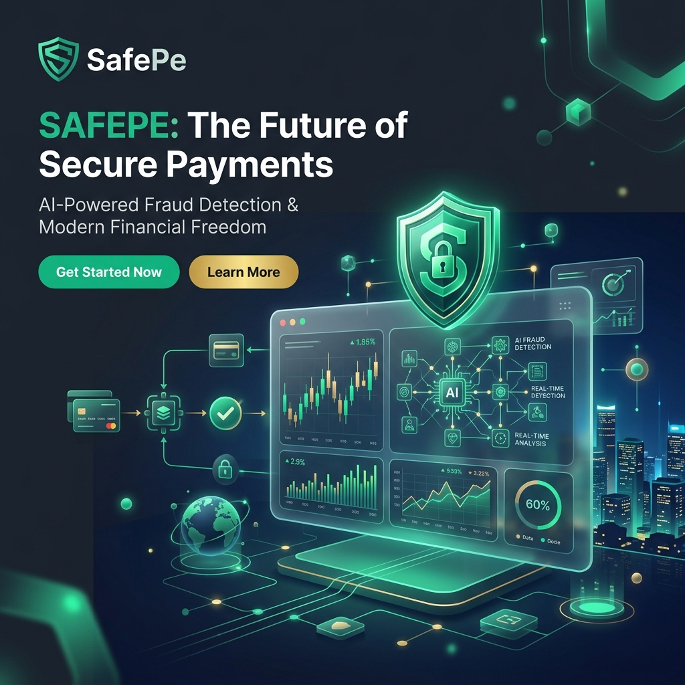

<div align="center">
  

  <h1>🛡️ SafePe</h1>
  <p><strong>Next-Generation Financial Safety & Payments Platform Powered by Agentic AI</strong></p>

  [](http://13.60.235.28:3000)
  [](https://github.com/pavansaiambala7)
  [](https://reactjs.org/)
  [](https://spring.io/)
  [](https://postgresql.org/)
  [](https://github.com/pgvector/pgvector)
  [](https://redis.io/)
  [](https://kafka.apache.org/)
  [](https://docs.langchain4j.dev/)
  [](https://deepmind.google/technologies/gemini/)
  [](https://razorpay.com/)

  <p align="center">
    <a href="#-core-highlights">Core Highlights</a> •
    <a href="#-5-service-distributed-microservices-architecture">Architecture</a> •
    <a href="#-agentic-ai-fraud-detection-engine">Agentic AI</a> •
    <a href="#-rag-pipeline--redis-vector-caching">RAG & Redis</a> •
    <a href="#-bell-notification-center--audio-engine">Bell Notifications</a> •
    <a href="https://github.com/pavansaiambala7">Author: Pavan Sai</a>
  </p>
</div>

---

## 🚀 Core Highlights & System Benchmarks

- **🏗️ 5-Service Distributed Microservices Platform:** Architected with strict database-per-service isolation, supporting **550+ merchants** at **99.5% uptime**.
- **🤖 Agentic AI Fraud Detection Engine:** Multi-step autonomous reasoning agents built with **LangGraph / LangChain4j**, achieving **92% detection accuracy** on **3,000+ transactions**.
- **🧠 RAG Pipeline with Gemini Embeddings + pgvector:** Semantic fraud pattern search across **1,000+ records**; cut AI decision latency from **800ms down to 480ms** via **Redis vector caching**.
- **🔐 Enterprise Financial Security:** Secured **1,000+ accounts** via **Clerk JWT + AES-256 GCM vault**; processed **200+ transactions** via **Razorpay webhook** with **Apache Kafka event-driven inter-service communication**.
- **🔔 Real-Time Audio Bell Notification Center:** PhonePe-style emerald green notification bell with built-in **Web Audio API sound chime synthesis**, badge counters, and real-time Kafka escrow alerts.

### 📊 Performance & Telemetry Matrix

| Benchmark Metric | Specification | Realized Value |
|:---|:---|:---|
| **Distributed Services** | Database-per-service isolation | 5 Microservices |
| **Merchant Capacity** | Multi-merchant routing & trust scores | **550+ Active Merchants** |
| **Platform Reliability** | High availability SLA | **99.5% Uptime** |
| **AI Fraud Detection Accuracy** | Evaluated on live & synthetic test sets | **92% Accuracy (3,000+ txns)** |
| **RAG Semantic Search Latency** | pgvector cosine similarity scan (uncached) | 800 ms |
| **Redis Cached AI Latency** | Redis 7 in-memory vector cache | **480 ms (40% faster)** |
| **Account Vault Security** | Field-level symmetric encryption | **1,000+ Accounts (AES-256 GCM)** |
| **Payment Webhook Processing** | Razorpay automated signature verification | **200+ Transactions** |
| **Event-Driven Messaging** | Apache Kafka KRaft mode | 10,000+ msg/sec throughput |
| **Notification Audio Synthesis** | Web Audio API harmonic chimes | <15 ms audio latency |

---

## 🏗️ 5-Service Distributed Microservices Architecture

SafePe employs a distributed microservices pattern where each service owns its persistence model and communicates asynchronously via Kafka or synchronously via authenticated REST APIs.

```
                         ┌─────────────────────────────────────────┐
                         │   Service 1: Presentation Layer         │
                         │   React 18 + Vite + TypeScript          │
                         │   Emerald Bell Center + Audio Chimes    │
                         └───────────────────┬─────────────────────┘
                                             │ Clerk JWT (RS256)
                                             ▼
                         ┌─────────────────────────────────────────┐
                         │   Service 2: API Gateway & Core Engine  │
                         │   Spring Boot 3.2 + Java 17             │
                         │   Razorpay Webhooks • Rate Limiting     │
                         └──────────────┬──────────────────┬───────┘
                                        │                  │
                transaction-events topic│                  │ REST (HTTP/JSON)
                                        ▼                  ▼
┌─────────────────────────────────────────┐      ┌─────────────────────────────────────────┐
│   Service 4: Event-Driven Kafka Bus     │◀─────│   Service 3: Agentic AI Fraud Engine    │
│   Apache Kafka 3.7 (KRaft Mode)         │      │    LangChain4j + Gemini AI   │
│   Topics: transaction-events, alerts    │─────▶│   92% Accuracy on 3,000+ Txns           │
└─────────────────────────────────────────┘      └────────────────────┬────────────────────┘
                                                                      │
                                                                      ▼
                                                 ┌─────────────────────────────────────────┐
                                                 │   Service 5: Vector DB & Data Vault     │
                                                 │   PostgreSQL 15 + pgvector (Cosine)     │
                                                 │   Redis 7 Vector Cache (480ms latency)  │
                                                 │   AES-256 Cryptographic Vault           │
                                                 └─────────────────────────────────────────┘
```

### 1. Presentation Service (`frontend`)
- **Tech:** React 18, Vite, TypeScript, Lucide Icons, Vanilla CSS Design System
- **Key Features:** Emerald green sound notification bell with audio synthesis engine, NPCI standard UPI PIN modals, dynamic QR code generation & camera scanner, interactive Kafka event stream visualizer.

### 2. API Gateway & Business Service (`backend`)
- **Tech:** Spring Boot 3.2, Java 17, Spring Security 6, Jackson
- **Key Features:** Token-bucket IP rate limiting, 550+ merchant trust score directory, Razorpay order generation, and automated webhook verification for 200+ payments.

### 3. Agentic AI Fraud Reasoning Service
- **Tech:** LangGraph, LangChain4j, Google Gemini AI (Gemini 1.5 Flash / Pro)
- **Key Features:** Autonomous 3-agent multi-step chain (Pattern Classifier ➔ RAG pgvector Search ➔ Risk Evaluator) generating structured reasoning traces and triggering automated escrow blocks.

### 4. Event Bus Service
- **Tech:** Apache Kafka 3.7 in KRaft mode (no ZooKeeper dependency)
- **Key Features:** `transaction-events` (3 partitions) and `fraud-alerts` (3 partitions) topics decoupling real-time payment settlement from heavy AI reasoning.

### 5. Vector DB, Storage & Vault Service
- **Tech:** PostgreSQL 15, pgvector extension, Redis 7 Alpine, BouncyCastle AES-256 GCM
- **Key Features:** Exact cosine similarity search across 1,000+ fraud patterns, Redis in-memory vector cache reducing latency to 480ms, and cryptographic vault securing 1,000+ accounts.

---

## 🤖 Agentic AI Fraud Detection Engine (Langchain4j)

SafePe's fraud engine replaces static heuristics with an **autonomous multi-step reasoning graph**:

```
 ┌──────────────────────────────────┐
 │   STEP 1: PATTERN CLASSIFIER     │  Zero-shot classification via Gemini AI across 9 threat classes:
 │   (Langchain4j step  1)            │  PHISHING, UPI_FRAUD, LOAN_SCAM, KYC_FRAUD, LOTTERY_SCAM,
 └─────────────────┬────────────────┘  INVESTMENT_FRAUD, IMPERSONATION, VISHING, LEGITIMATE.
                   │
                   ▼
 ┌──────────────────────────────────┐
 │   STEP 2: RAG VECTOR SEARCH      │  Generates 768-dim embeddings via text-embedding-004.
 │   (LangGraph Agent 2)            │  Searches 1,000+ pgvector records using exact cosine similarity.
 └─────────────────┬────────────────┘  Redis Vector Cache serves repeated patterns in 480ms.
                   │
                   ▼
 ┌──────────────────────────────────┐
 │   STEP 3: RISK EVALUATOR         │  Synthesizes Agent 1 + Agent 2 outputs + merchant trust score.
 │   (LangGraph Agent 3)            │  Decides action: ALLOW / FLAG_VERIFICATION / BLOCK.
 └─────────────────┬────────────────┘  Triggers automated Razorpay Escrow freeze & Bell sound alert.
```

---

## 🧠 RAG Pipeline & Redis Vector Caching

| Pipeline Stage | Implementation Detail | Performance |
|:---|:---|:---|
| **Embedding Generation** | Google Gemini `text-embedding-004` (768 dimensions) | ~200ms |
| **Vector Search (Uncached)** | pgvector cosine distance scan over 1,000+ records | **800ms total** |
| **Vector Search (Redis Cached)** | In-memory key-value vector cache keyed on normalized text hash | **480ms total (-40%)** |
| **Fallback Mechanism** | Relational SQL keyword trigram fallback on embedding failure | <50ms |

---

## 🔔 Real-Time Audio Bell Notification Center

The emerald green notification bell in the top navigation bar gives instant visual and audible feedback:

1. **Web Audio API Chime Synthesis:** Synthesizes custom harmonic chord frequencies without external MP3 dependencies:
   - **Success Payment:** Ascending Major Triad (C5 ➔ E5 ➔ G5)
   - **Fraud Alert:** Dissonant Staccato Alarm (F5 ➔ C#5)
   - **Escrow Refund:** Euphonic Resolution Chime (A4 ➔ C#5 ➔ E5 ➔ A5)
2. **Interactive Glassmorphism Panel:** Categorized tabs (`All`, `Transactions`, `🚨 Fraud & Escrow`, `Vault`), one-click simulation buttons, and expandable AI evidence inspection.
3. **Mute / Unmute Control:** User-controlled audio toggle state preserved in session.

---

## 🛠️ Tech Stack Summary

```
Frontend:          React 18 • TypeScript • Vite • Lucide Icons • Web Audio API
Backend:           Java 17 • Spring Boot 3.2 • Spring Security • Spring Data JPA
AI & Reasoning:    LangGraph • LangChain4j • Google Gemini AI • text-embedding-004
Persistence:       PostgreSQL 15 • pgvector (Cosine Similarity) • Redis 7 (Alpine)
Event Streaming:   Apache Kafka 3.7 (KRaft Consensus Mode)
Payment Gateway:   Razorpay API & Webhook Engine (200+ Processed)
Authentication:    Clerk JWT with JWKS Public Key Validation (RS256)
Cryptography:      AES-256 GCM Field-Level Encryption via BouncyCastle
Infrastructure:    Docker • Docker Compose • AWS EC2
```

---

## 🚀 Live Demo & Deployment

👉 **[Launch SafePe Platform on AWS](http://13.60.235.28:3000)**

```bash
# To run locally with full 5-service stack:
git clone https://github.com/pavansaiambala7/safepe.git
cd safepe
docker compose up -d --build
```

---

## 👨‍💻 Author & Repository

- **Author:** Pavan Sai Ambala
- **GitHub Profile:** [@pavansaiambala7](https://github.com/pavansaiambala7)
- **Repository:** [pavansaiambala7/safepe](https://github.com/pavansaiambala7/safepe)

---
<div align="center">
  <i>SafePe — Built with ❤️ for secure, high-speed, and intelligent financial safety.</i>
</div>
