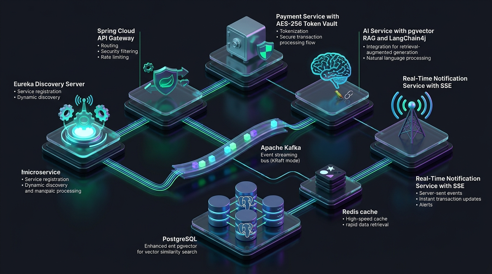
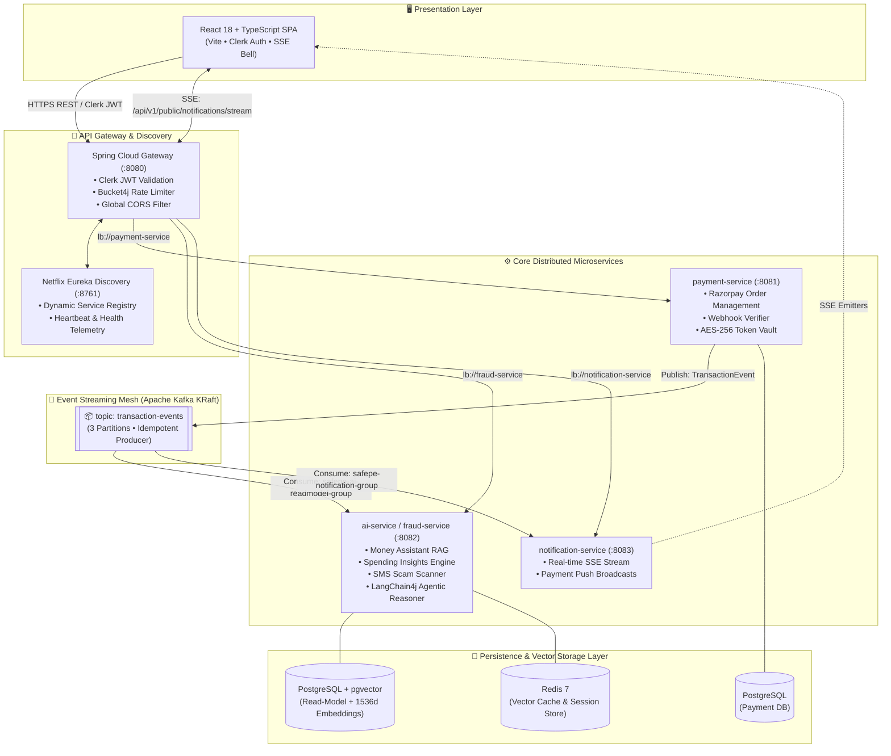
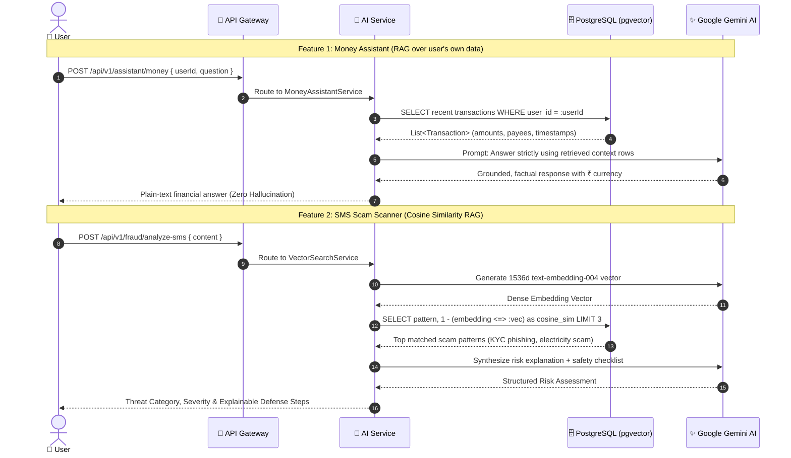

<div align="center">

# 🛡️ SafePe — Distributed AI-Powered UPI Payment Platform

[](https://openjdk.org/)
[](https://spring.io/projects/spring-boot)
[](https://spring.io/projects/spring-cloud)
[-black.svg?style=flat-square&logo=apache-kafka)](https://kafka.apache.org/)
[](https://github.com/pgvector/pgvector)
[](https://redis.io/)
[](https://github.com/langchain4j/langchain4j)
[](https://react.dev/)
[](LICENSE)

**An enterprise-grade, event-driven 5-microservice digital payment platform with pgvector RAG, Gemini AI, LangChain4j Agentic Reasoning, and AES-256 Tokenization.**

[🌐 **Live Demo Application**](https://safepe.pavansai.me) • [📖 **API Documentation**](#-api-specification) • [🚀 **Getting Started**](#-quick-start)

---

</div>

## 📐 3D System Architecture

<div align="center">
  
</div>

---

## 🏛️ System Overview & Architecture

SafePe is engineered around a **Database-per-Service**, **CQRS Read-Model**, and **Event-Driven Architecture** across 5 decoupled services communicating through an **Apache Kafka (KRaft mode)** bus.

### High-Level Topology


```mermaid
flowchart TB
    subgraph ClientLayer["🖥️ Presentation Layer"]
        UI["React 18 + TypeScript SPA\n(Vite • Clerk Auth • SSE Bell)"]
    end

    subgraph GatewayLayer["🚪 API Gateway & Discovery"]
        GW["Spring Cloud Gateway (:8080)\n• Clerk JWT Validation\n• Bucket4j Rate Limiter\n• Global CORS Filter"]
        EUREKA["Netflix Eureka Discovery (:8761)\n• Dynamic Service Registry\n• Heartbeat & Health Telemetry"]
        GW <--> EUREKA
    end

    subgraph ServiceLayer["⚙️ Core Distributed Microservices"]
        PAYMENT["payment-service (:8081)\n• Razorpay Order Management\n• Webhook Verifier\n• AES-256 Token Vault"]
        AI["ai-service / fraud-service (:8082)\n• Money Assistant RAG\n• Spending Insights Engine\n• SMS Scam Scanner\n• LangChain4j Agentic Reasoner"]
        NOTIF["notification-service (:8083)\n• Real-time SSE Stream\n• Payment Push Broadcasts"]
    end

    subgraph EventMesh["📨 Event Streaming Mesh (Apache Kafka KRaft)"]
        TOPIC_TXN[["📦 topic: transaction-events\n(3 Partitions • Idempotent Producer)"]]
    end

    subgraph DataLayer["💾 Persistence & Vector Storage Layer"]
        PG_PAY[("PostgreSQL\n(Payment DB)")]
        PG_AI[("PostgreSQL + pgvector\n(Read-Model + 1536d Embeddings)")]
        REDIS[("Redis 7\n(Vector Cache & Session Store)")]
    end

    UI -->|"HTTPS REST / Clerk JWT"| GW
    UI <-->|"SSE: /api/v1/public/notifications/stream"| GW
    
    GW -->|"lb://payment-service"| PAYMENT
    GW -->|"lb://fraud-service"| AI
    GW -->|"lb://notification-service"| NOTIF

    PAYMENT -->|"Publish: TransactionEvent"| TOPIC_TXN
    TOPIC_TXN -->|"Consume: safepe-ai-readmodel-group"| AI
    TOPIC_TXN -->|"Consume: safepe-notification-group"| NOTIF

    PAYMENT --- PG_PAY
    AI --- PG_AI
    AI --- REDIS
    NOTIF -.->|"SSE Emitters"| UI
```

---

## 📦 The 5 Core Microservices

| # | Service Name | Port | Primary Tech Stack | Core Responsibilities |
|---|---|---|---|---|
| **1** | **`eureka-server`** | `8761` | Spring Cloud Netflix Eureka | Service registration, dynamic load balancing lookup, service health heartbeats. |
| **2** | **`api-gateway`** | `8080` | Spring Cloud Gateway, Reactive WebFlux | Clerk JWKS token verification, IP token-bucket rate limiting (Bucket4j), route aggregation. |
| **3** | **`payment-service`** | `8081` | Spring Boot 3.2, JPA, Razorpay SDK | Razorpay order creation, payment signature verification, dynamic UPI QR generation, AES-256 card/account tokenization vault. Publishes `transaction-events`. |
| **4** | **`fraud-service`** *(AI Service)* | `8082` | Spring Boot 3.2, pgvector, LangChain4j, Gemini | Event read-model consumer, Money Assistant (RAG over user txns), Spending Insights, SMS Scam Scanner, 3-step Agentic AI Reasoner. |
| **5** | **`notification-service`** | `8083` | Spring Boot 3.2, Spring MVC SSE | Real-time Server-Sent Events (SSE) notification hub, consumes `transaction-events` to push instant payment receipt chimes to the UI. |

---

## 🤖 Real-World AI Capabilities

SafePe avoids superficial AI wrappers and implements genuine, verifiable AI workflows grounded in mathematical vector similarity and retrieval-augmented generation:


```mermaid
sequenceDiagram
    autonumber
    actor User as 👤 User
    participant GW as 🚪 API Gateway
    participant AI as 🧠 AI Service
    participant PGV as 🗄️ PostgreSQL (pgvector)
    participant GEMINI as ✨ Google Gemini AI

    Note over User,GEMINI: Feature 1: Money Assistant (RAG over user's own data)
    User->>GW: POST /api/v1/assistant/money { userId, question }
    GW->>AI: Route to MoneyAssistantService
    AI->>PGV: SELECT recent transactions WHERE user_id = :userId
    PGV-->>AI: List<Transaction> (amounts, payees, timestamps)
    AI->>GEMINI: Prompt: Answer strictly using retrieved context rows
    GEMINI-->>AI: Grounded, factual response with ₹ currency
    AI-->>User: Plain-text financial answer (Zero Hallucination)

    Note over User,GEMINI: Feature 2: SMS Scam Scanner (Cosine Similarity RAG)
    User->>GW: POST /api/v1/fraud/analyze-sms { content }
    GW->>AI: Route to VectorSearchService
    AI->>GEMINI: Generate 1536d text-embedding-004 vector
    GEMINI-->>AI: Dense Embedding Vector
    AI->>PGV: SELECT pattern, 1 - (embedding <=> :vec) as cosine_sim LIMIT 3
    PGV-->>AI: Top matched scam patterns (KYC phishing, electricity scam)
    AI->>GEMINI: Synthesize risk explanation + safety checklist
    GEMINI-->>AI: Structured Risk Assessment
    AI-->>User: Threat Category, Severity & Explainable Defense Steps
```

### 1. 💬 Money Assistant (RAG over User's Own Transactions)
- **Endpoint:** `POST /api/v1/assistant/money`
- **Mechanism:** Ingests the user's localized read-model transaction history, structures compact tabular context, and constrains Gemini to answer solely from verified historical facts.
- **Example Queries:** *"How much did I transfer to electricity this month?"*, *"What was my biggest expense last week?"*

### 2. 📊 Spending Insights & Financial Health
- **Endpoint:** `GET /api/v1/assistant/insights?userId={id}`
- **Mechanism:** Aggregates transaction velocity, top 5 payees, and total spend volume; synthesizes a concise 3-4 sentence financial narrative with practical budgeting advice.

### 3. 🔍 SMS Scam Scanner (pgvector Knowledge Base)
- **Endpoint:** `POST /api/v1/fraud/analyze-sms`
- **Mechanism:** Calculates cosine similarity `1 - (embedding <=> query_vec)` against 1536-dimensional vector embeddings of known phishing, KYC expiration, fake electricity, and lottery scams stored in PostgreSQL with pgvector.

### 4. 🕵️ Agentic AI Reasoner (LangChain4j)
- **Endpoint:** `POST /api/v1/fraud/agentic-analyze`
- **Mechanism:** 3-step autonomous pipeline:
  1. **Pattern Classification:** Zero-shot categorizer.
  2. **Context & Tool Gathering:** Executes vector search and velocity checks.
  3. **Risk Synthesis:** Returns structured `RISK_SCORE` (0-100), `ACTION` (`ALLOW`, `FLAG`, `BLOCK`), and step-by-step reasoning logs.

---

## ⚡ Event-Driven Lifecycle (CQRS Flow)

```
[Payment Checkout]
       │
       ▼
1. PaymentService.createPaymentOrder()
       │
       ├── Save PENDING Transaction (Postgres OLTP)
       │
       └── Publish TransactionEvent (Kafka 'transaction-events')
                │
                ├──▶ 2. PaymentEventConsumer (AI Service)
                │         └── Ingest into local read-model (Postgres AI DB)
                │
                └──▶ 3. NotificationKafkaConsumer (Notification Service)
                          └── Push SSE event ("Payment of ₹X to Y successful")
```

---

## 🔒 Security & Data Protection Architecture

```
                       ┌────────────────────────────────────────┐
                       │           Clerk JWT Auth               │
                       │   (RSA-256 JWKS Signature Verify)     │
                       └──────────────────┬─────────────────────┘
                                          │
                       ┌──────────────────▼─────────────────────┐
                       │          Bucket4j Rate Limiting        │
                       │     (100 requests / min per IP)        │
                       └──────────────────┬─────────────────────┘
                                          │
                       ┌──────────────────▼─────────────────────┐
                       │      AES-256 Tokenization Vault        │
                       │    (PCI-DSS Zero-Plaintext at Rest)    │
                       └────────────────────────────────────────┘
```

- **Clerk JWT Verification:** Stateless cryptographic signature validation at the API Gateway using Clerk JWKS public keys.
- **Bucket4j Token Bucket:** In-memory rate limiter protecting upstream endpoints against automated brute-force attempts.
- **AES-256 GCM Tokenization Vault:** Sensitive bank accounts, card numbers, and UPI IDs are encrypted at rest using AES-256 with initialization vectors (IV) before persistence.

---

## 📡 API Specification

### Payment Service (`/api/v1/payments/**`, `/api/v1/vault/**`)

```bash
# 1. Create a Razorpay UPI Payment Order
curl -X POST http://localhost:8080/api/v1/payments/order \
  -H "Content-Type: application/json" \
  -H "Authorization: Bearer <CLERK_JWT>" \
  -d '{"amount": 1500.00, "upiId": "merchant@oksbi"}'

# 2. Verify Razorpay Payment Signature
curl -X POST http://localhost:8080/api/v1/payments/verify \
  -H "Content-Type: application/json" \
  -d '{
    "razorpayOrderId": "order_NXK182910",
    "razorpayPaymentId": "pay_NXK182911",
    "razorpaySignature": "9a8b7c6d5e4f3a2b..."
  }'

# 3. Generate Dynamic UPI QR Code
curl -X POST http://localhost:8080/api/v1/payments/qr \
  -H "Content-Type: application/json" \
  -d '{"amount": 499.00, "description": "Coffee & Snacks"}'
```

### AI Service (`/api/v1/assistant/**`, `/api/v1/fraud/**`)

```bash
# 1. Money Assistant RAG (User Transactions)
curl -X POST http://localhost:8080/api/v1/assistant/money \
  -H "Content-Type: application/json" \
  -d '{
    "userId": "user_2test123",
    "question": "How much have I spent on groceries this week?"
  }'

# 2. Spending Insights
curl -X GET "http://localhost:8080/api/v1/assistant/insights?userId=user_2test123"

# 3. SMS Scam Scanner
curl -X POST http://localhost:8080/api/v1/fraud/analyze-sms \
  -H "Content-Type: application/json" \
  -d '{"content": "Dear customer, your electricity will be disconnected tonight. Call 9876543210 immediately."}'

# 4. Agentic AI Multi-Step Reasoner
curl -X POST http://localhost:8080/api/v1/fraud/agentic-analyze \
  -H "Content-Type: application/json" \
  -d '{
    "message": "Click bit.ly/kyc-update to renew your expired bank account",
    "upiId": "fraud.desk@ybl",
    "userId": "user_2test123"
  }'
```

### Notification Service (`/api/v1/public/notifications/**`)

```bash
# Subscribe to live SSE event stream
curl -N http://localhost:8080/api/v1/public/notifications/stream
```

---

## 🚀 Quick Start

### Prerequisites
- **Docker & Docker Compose** (v24+)
- **Java 17+** & **Maven** (optional for local builds)
- **Node.js 18+** (for frontend development)

### 1. Clone & Configure Environment
```bash
git clone https://github.com/pavansaiambala7/safepe.git
cd safepe

# Create .env from template
cp .env.example .env
```

Set the required environment keys in `.env`:
```env
RAZORPAY_KEY_ID=rzp_test_your_key_id
RAZORPAY_KEY_SECRET=your_razorpay_secret
GEMINI_API_KEY=your_google_gemini_api_key
VITE_VITE_CLERK_PUBLISHABLE_KEY=pk_test_your_clerk_key
```

### 2. Run with Docker Compose
```bash
# Build and start all 5 microservices + Postgres (pgvector) + Redis + Kafka
docker compose build --no-cache
docker compose up -d
```

### 3. Verify Health & Discovery
Open the **Eureka Discovery Console** at `http://localhost:8761` to verify all 4 backend instances are healthy:
- `API-GATEWAY`
- `PAYMENT-SERVICE`
- `FRAUD-SERVICE` (AI Service)
- `NOTIFICATION-SERVICE`

Launch the frontend application at `http://localhost:3000`.

---

## 🧪 Local Build & Test Verification

```bash
# Compile and package all Spring Boot modules
./mvnw clean package -DskipTests

# Build React production bundle
cd frontend && npm install && npm run build
```

---

## 📂 Project Structure

```
safepe/
├── api-gateway/            # Spring Cloud Gateway (8080) + Clerk JWT + Rate Limiter
├── eureka-server/          # Netflix Eureka Service Discovery (8761)
├── payment-service/        # Razorpay Orders, QR, Bank Transfer, AES-256 Vault (8081)
├── fraud-service/          # AI Service: RAG, Insights, Scam Scanner, Agentic AI (8082)
├── notification-service/   # Real-time Server-Sent Events (SSE) Stream (8083)
├── frontend/               # React 18 + TypeScript + Vite + Tailwind/Custom CSS
├── docs/                   # 3D Architecture visuals & architectural documentation
├── docker-compose.yml      # Multi-container orchestration (KRaft Kafka, pgvector, Redis)
└── pom.xml                 # Multi-module Maven root aggregator
```

---


