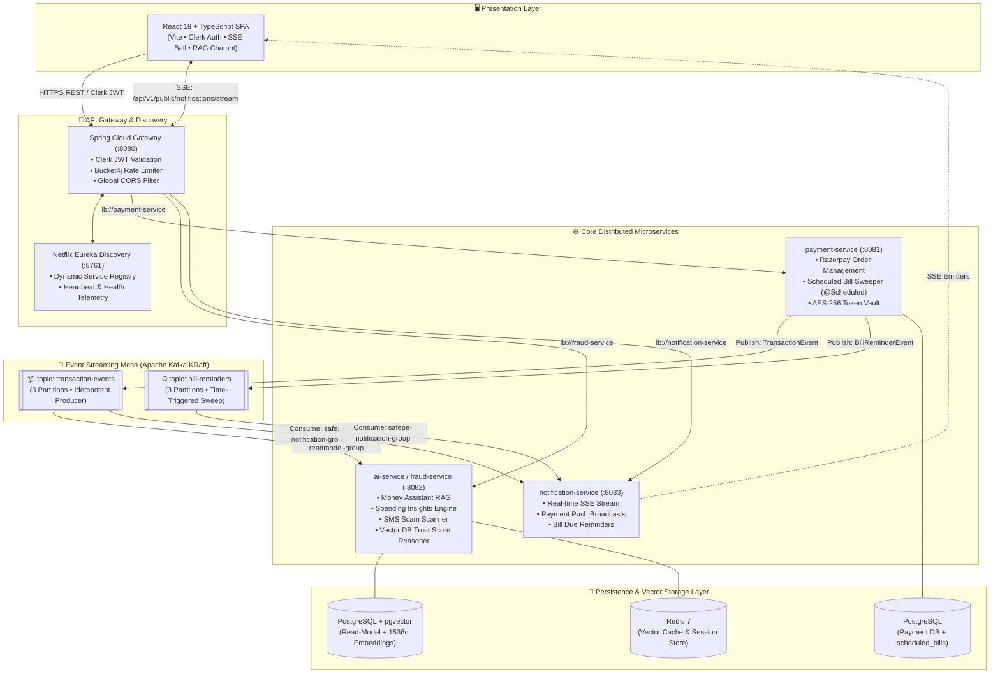
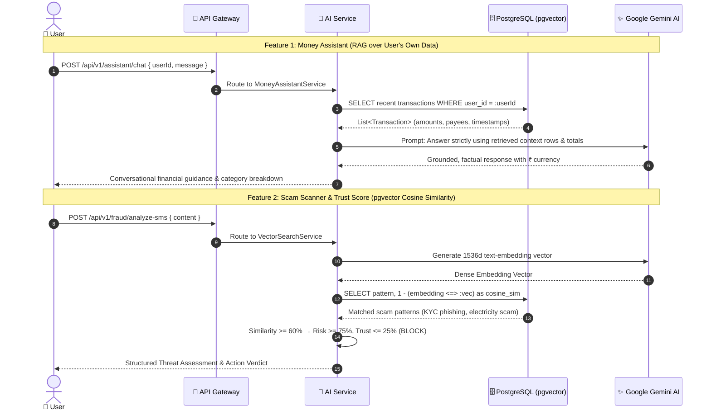

<div align="center">

# 🛡️ SafePe — Distributed AI-Powered UPI Payment Platform

[](https://openjdk.org/)
[](https://spring.io/projects/spring-boot)
[](https://spring.io/projects/spring-cloud)
[-black.svg?style=flat-square&logo=apache-kafka)](https://kafka.apache.org/)
[](https://github.com/pgvector/pgvector)
[](https://redis.io/)
[](https://github.com/langchain4j/langchain4j)
[](https://react.dev/)
[](LICENSE)

**An enterprise-grade, event-driven 5-microservice digital payment platform with pgvector RAG, Gemini AI Money Assistant, Vector DB Trust Scoring, Scheduled Bill Reminders (Kafka + SSE), and AES-256 Tokenization.**

[🌐 **Live Demo Application**](http://13.60.235.28:3000) • [💻 **GitHub Repository**](https://github.com/pavansaiambala7/safepe) • [📖 **API Documentation**](#-api-specification) • [🚀 **Quick Start**](#-quick-start)

---

</div>

## 📐 3D System Architecture

<div align="center">
  
</div>

---

## 🏛️ System Overview & Architecture

SafePe is engineered around a **Database-per-Service**, **CQRS Read-Model**, and **Event-Driven Architecture** across 5 decoupled services communicating through an **Apache Kafka (KRaft mode)** bus.

### High-Level Topology


```mermaid
flowchart TB
    subgraph ClientLayer["🖥️ Presentation Layer"]
        UI["React 19 + TypeScript SPA\n(Vite • Clerk Auth • SSE Bell • RAG Chatbot)"]
    end

    subgraph GatewayLayer["🚪 API Gateway & Discovery"]
        GW["Spring Cloud Gateway (:8080)\n• Clerk JWT Validation\n• Bucket4j Rate Limiter\n• Global CORS Filter"]
        EUREKA["Netflix Eureka Discovery (:8761)\n• Dynamic Service Registry\n• Heartbeat & Health Telemetry"]
        GW <--> EUREKA
    end

    subgraph ServiceLayer["⚙️ Core Distributed Microservices"]
        PAYMENT["payment-service (:8081)\n• Razorpay Order Management\n• Scheduled Bill Sweeper (@Scheduled)\n• AES-256 Token Vault"]
        AI["ai-service / fraud-service (:8082)\n• Money Assistant RAG\n• Spending Insights Engine\n• SMS Scam Scanner\n• Vector DB Trust Score Reasoner"]
        NOTIF["notification-service (:8083)\n• Real-time SSE Stream\n• Payment Push Broadcasts\n• Bill Due Reminders"]
    end

    subgraph EventMesh["📨 Event Streaming Mesh (Apache Kafka KRaft)"]
        TOPIC_TXN[["📦 topic: transaction-events\n(3 Partitions • Idempotent Producer)"]]
        TOPIC_BILL[["⏰ topic: bill-reminders\n(3 Partitions • Time-Triggered Sweep)"]]
    end

    subgraph DataLayer["💾 Persistence & Vector Storage Layer"]
        PG_PAY[("PostgreSQL\n(Payment DB + scheduled_bills)")]
        PG_AI[("PostgreSQL + pgvector\n(Read-Model + 1536d Embeddings)")]
        REDIS[("Redis 7\n(Vector Cache & Session Store)")]
    end

    UI -->|"HTTPS REST / Clerk JWT"| GW
    UI <-->|"SSE: /api/v1/public/notifications/stream"| GW
    
    GW -->|"lb://payment-service"| PAYMENT
    GW -->|"lb://fraud-service"| AI
    GW -->|"lb://notification-service"| NOTIF

    PAYMENT -->|"Publish: TransactionEvent"| TOPIC_TXN
    PAYMENT -->|"Publish: BillReminderEvent"| TOPIC_BILL
    
    TOPIC_TXN -->|"Consume: safepe-ai-readmodel-group"| AI
    TOPIC_TXN -->|"Consume: safepe-notification-group"| NOTIF
    TOPIC_BILL -->|"Consume: safepe-notification-group"| NOTIF

    PAYMENT --- PG_PAY
    AI --- PG_AI
    AI --- REDIS
    NOTIF -.->|"SSE Emitters"| UI
```

---

## 📦 The 5 Core Microservices

| # | Service Name | Port | Primary Tech Stack | Core Responsibilities |
|---|---|---|---|---|
| **1** | **`eureka-server`** | `8761` | Spring Cloud Netflix Eureka | Service registration, dynamic load balancing lookup, service health heartbeats. |
| **2** | **`api-gateway`** | `8080` | Spring Cloud Gateway, Reactive WebFlux | Clerk JWKS token verification, IP token-bucket rate limiting (Bucket4j), route aggregation for payments, bills, fraud, and notifications. |
| **3** | **`payment-service`** | `8081` | Spring Boot 3.2, JPA, Razorpay SDK | Razorpay order creation, payment signature verification, dynamic UPI QR generation, AES-256 card token vault, `@Scheduled` bill reminder sweeper. Publishes `transaction-events` & `bill-reminders`. |
| **4** | **`fraud-service`** *(AI Service)* | `8082` | Spring Boot 3.2, pgvector, LangChain4j, Gemini | Event read-model consumer, Money Assistant (RAG over user txns), Spending Insights, SMS Scam Scanner, Vector DB Trust & Risk Evaluation Engine. |
| **5** | **`notification-service`** | `8083` | Spring Boot 3.2, Spring MVC SSE | Real-time Server-Sent Events (SSE) notification hub. Consumes `transaction-events` and `bill-reminders` to push instant payment receipt chimes and bill alerts to the UI. |

---

## 🤖 Real-World AI & Security Capabilities

SafePe implements verifiable, mathematical AI workflows grounded in vector similarity and retrieval-augmented generation:


```mermaid
sequenceDiagram
    autonumber
    actor User as 👤 User
    participant GW as 🚪 API Gateway
    participant AI as 🧠 AI Service
    participant PGV as 🗄️ PostgreSQL (pgvector)
    participant GEMINI as ✨ Google Gemini AI

    Note over User,GEMINI: Feature 1: Money Assistant (RAG over User's Own Data)
    User->>GW: POST /api/v1/assistant/chat { userId, message }
    GW->>AI: Route to MoneyAssistantService
    AI->>PGV: SELECT recent transactions WHERE user_id = :userId
    PGV-->>AI: List<Transaction> (amounts, payees, timestamps)
    AI->>GEMINI: Prompt: Answer strictly using retrieved context rows & totals
    GEMINI-->>AI: Grounded, factual response with ₹ currency
    AI-->>User: Conversational financial guidance & category breakdown

    Note over User,GEMINI: Feature 2: Scam Scanner & Trust Score (pgvector Cosine Similarity)
    User->>GW: POST /api/v1/fraud/analyze-sms { content }
    GW->>AI: Route to VectorSearchService
    AI->>GEMINI: Generate 1536d text-embedding vector
    GEMINI-->>AI: Dense Embedding Vector
    AI->>PGV: SELECT pattern, 1 - (embedding <=> :vec) as cosine_sim
    PGV-->>AI: Matched scam patterns (KYC phishing, electricity scam)
    AI->>AI: Similarity >= 60% → Risk >= 75%, Trust <= 25% (BLOCK)
    AI-->>User: Structured Threat Assessment & Action Verdict
```

### 1. 💬 RAG Money Assistant Chatbot
- **Endpoints:** `POST /api/v1/assistant/chat`, `POST /api/v1/assistant/money`
- **Mechanism:** Ingests the user's localized read-model transaction history, structures compact context, and constrains Gemini to answer solely from verified historical facts.
- **Example Queries:** *"How much did I spend on Food & Dining this month?"*, *"What was my biggest transaction recently?"*, *"Give me a plan to save ₹5,000"*.

### 2. 📊 AI Spending Insights
- **Endpoint:** `GET /api/v1/assistant/insights?userId={id}`
- **Mechanism:** Aggregates transaction velocity, top payees, and total spend volume; synthesizes a concise 3-4 sentence financial narrative with practical budgeting advice and interactive category donut charts.

### 3. 🔍 SMS Scam Scanner & Vector DB Trust Scoring
- **Endpoint:** `POST /api/v1/fraud/analyze-sms`
- **Rule-Driven Vector DB Scoring:**
  - **Pattern Matched ($\ge 60\%$ similarity):** Risk $\ge 75\%$ (High Risk), Trust $\le 25\%$ (Low Trust), Action: `BLOCK`.
  - **Clean / No Match:** Risk $< 50\%$ (10–25% Low Risk), Trust $\ge 85–95\%$ (High Trust), Action: `ALLOW`.

### 4. ⏰ Scheduled Bill / EMI / Recharge Reminders (Kafka + SSE)
- **Mechanism:** `@Scheduled(cron = "0 0 9 * * *")` sweep in `payment-service` finds bills due within 3 days, publishes `BillReminderEvent` to `bill-reminders` Kafka topic, and `notification-service` broadcasts instant SSE notifications (`💳`, `📆`, `📱`) to the UI bell.
- **Manual Demo Endpoint:** `POST /api/v1/bills/run-reminders` (replayable on stage without marking bills notified).

---

## ⚡ Event-Driven Lifecycle (CQRS Flow)

```
[Payment Checkout]
       │
       ▼
1. PaymentService.createPaymentOrder()
       │
       ├── Save PENDING Transaction (Postgres OLTP)
       │
       └── Publish TransactionEvent (Kafka 'transaction-events')
                │
                ├──▶ 2. PaymentEventConsumer (AI Service)
                │         └── Ingest into local read-model (Postgres AI DB)
                │
                └──▶ 3. NotificationConsumer (Notification Service)
                          └── Push SSE event ("Payment of ₹X successful")

[Time-Triggered Bill Sweeper]
       │
       ▼
1. @Scheduled (daily 9 AM or POST /api/v1/bills/run-reminders)
       │
       └── Query scheduled_bills due within 3 days
                │
                └── Publish BillReminderEvent (Kafka 'bill-reminders')
                          │
                          └──▶ 2. BillReminderConsumer (Notification Service)
                                    └── Push SSE event ("💳 HDFC Card due in 3 days")
```

---

## 🔒 Security & Data Protection Architecture

- **Clerk JWT Verification:** Stateless cryptographic signature validation at the API Gateway using Clerk JWKS public keys.
- **Bucket4j Token Bucket:** In-memory rate limiter (100 req/min per IP) protecting upstream endpoints against automated attacks.
- **AES-256 GCM Tokenization Vault:** Sensitive bank accounts, card numbers, and UPI IDs are encrypted at rest using AES-256 with initialization vectors (IV) before persistence.

---

## 📡 API Specification

### Payment & Bill Service (`/api/v1/payments/**`, `/api/v1/bills/**`, `/api/v1/vault/**`)

```bash
# 1. Create a Razorpay UPI Payment Order
curl -X POST http://localhost:8080/api/v1/payments/order \
  -H "Content-Type: application/json" \
  -H "Authorization: Bearer <CLERK_JWT>" \
  -d '{"amount": 1500.00, "upiId": "merchant@oksbi"}'

# 2. Trigger Scheduled Bill Reminders (Kafka + SSE)
curl -X POST http://localhost:8080/api/v1/bills/run-reminders

# 3. Create a Scheduled Bill / EMI
curl -X POST http://localhost:8080/api/v1/bills \
  -H "Content-Type: application/json" \
  -d '{
    "userId": "demo_user",
    "type": "CC_BILL",
    "payeeName": "HDFC Credit Card",
    "amount": "12300",
    "dueDate": "2026-09-01"
  }'

# 4. Generate Dynamic UPI QR Code
curl -X POST http://localhost:8080/api/v1/payments/qr \
  -H "Content-Type: application/json" \
  -d '{"amount": 499.00, "description": "Coffee & Snacks"}'
```

### AI Service (`/api/v1/assistant/**`, `/api/v1/fraud/**`)

```bash
# 1. Money Assistant RAG Chat
curl -X POST http://localhost:8080/api/v1/assistant/chat \
  -H "Content-Type: application/json" \
  -d '{
    "userId": "demo_user",
    "message": "How much have I spent on food this month?"
  }'

# 2. Spending Insights
curl -X GET "http://localhost:8080/api/v1/assistant/insights?userId=demo_user"

# 3. SMS Scam Scanner (Cosine Similarity Vector Search)
curl -X POST http://localhost:8080/api/v1/fraud/analyze-sms \
  -H "Content-Type: application/json" \
  -d '{"content": "Dear customer, your electricity power will be disconnected tonight. Call 9876543210 immediately."}'
```

### Notification Service (`/api/v1/public/notifications/**`)

```bash
# Subscribe to live SSE event stream
curl -N http://localhost:8080/api/v1/public/notifications/stream
```

---

## 🚀 Quick Start

### Prerequisites
- **Docker & Docker Compose** (v24+)
- **Java 17+** & **Maven**
- **Node.js 18+**

### 1. Clone & Configure Environment
```bash
git clone https://github.com/pavansaiambala7/safepe.git
cd safepe

# Copy environment template
cp .env.example .env
```

Set the required environment keys in `.env`:
```env
RAZORPAY_KEY_ID=rzp_test_your_key_id
RAZORPAY_KEY_SECRET=your_razorpay_secret
GEMINI_API_KEY=your_google_gemini_api_key
VITE_VITE_CLERK_PUBLISHABLE_KEY=pk_test_your_clerk_key
```

### 2. Run Full Stack with Docker Compose
```bash
# Build and start all 5 microservices + Postgres (pgvector) + Redis + Kafka
docker compose build --no-cache
docker compose up -d
```

### 3. Verify Health & Access
- **Frontend SPA:** `http://localhost:3000` (or `http://localhost:5173` in Vite dev mode)
- **Eureka Service Registry:** `http://localhost:8761`
- **Spring Cloud Gateway:** `http://localhost:8080`

---

## 🧪 Local Build & Test Verification

```bash
# Compile and package all Spring Boot modules
./mvnw clean package -DskipTests

# Build React production bundle
cd frontend && npm install && npm run build
```

---

## 📂 Project Structure

```
safepe/
├── api-gateway/            # Spring Cloud Gateway (8080) + Clerk JWT + Rate Limiter
├── eureka-server/          # Netflix Eureka Service Discovery (8761)
├── payment-service/        # Razorpay Orders, Bills Scheduler, AES-256 Vault (8081)
├── fraud-service/          # AI Service: RAG, Insights, Scam Scanner, Vector Trust (8082)
├── notification-service/   # Real-time Server-Sent Events (SSE) Stream (8083)
├── frontend/               # React 19 + TypeScript + Vite (RAG Assistant + SSE Bell)
├── docs/                   # 3D Architecture visuals & architectural documentation
├── docker-compose.yml      # Multi-container orchestration (KRaft Kafka, pgvector, Redis)
└── pom.xml                 # Multi-module Maven root aggregator
```

---

## 👨‍💻 Author

Engineered by **[Pavan Sai Ambala](https://github.com/pavansaiambala7)**  
🌐 [Live Application](http://13.60.235.28:3000) • 💼 [LinkedIn](https://linkedin.com) • 🐙 [GitHub Profile](https://github.com/pavansaiambala7)
